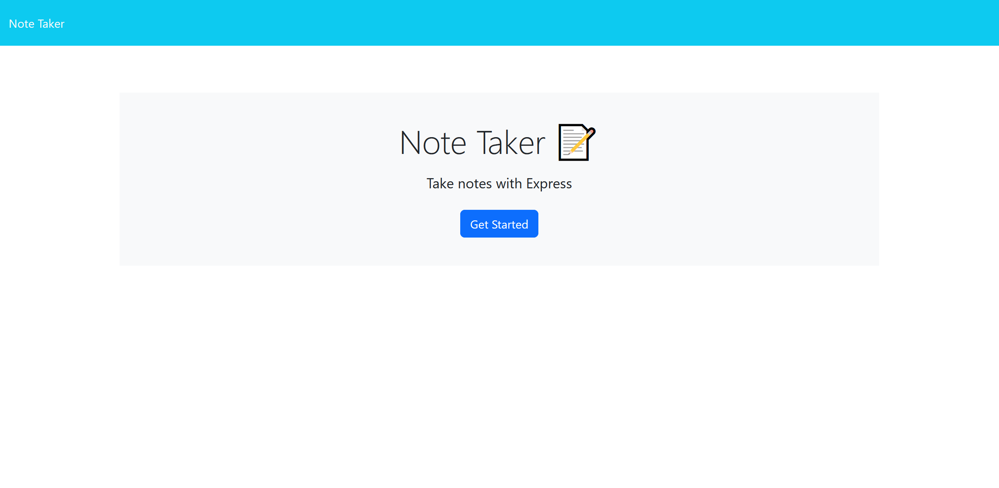
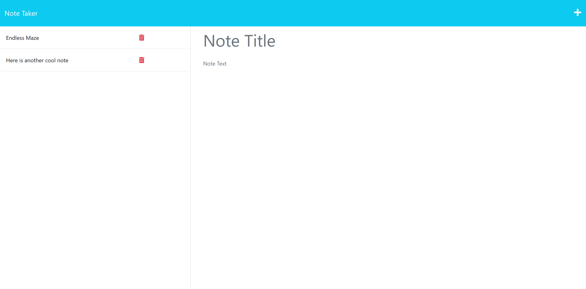

# EndlessMaze

EndlessMaze is an application that allows you to write and save notes. It provides a user-friendly interface for organizing your thoughts and keeping track of tasks you need to complete. The application uses an Express.js back end to store and retrieve note data from a JSON file.

## Installation

To install and run the Note Taker application locally, you'll need to follow these steps:

1. Clone the repository to your local machine using the command:

- git clone https://github.com/nstepper/11-endlessmaze.git

2. Navigate to the project's root directory.
3. Install the dependencies by running the command: 

- npm install

4. Start the application by running the command: `npm start`.
5. Open your web browser and visit `http://localhost:3000` to access the application.

## Technologies Used

- Express.js: A minimal and flexible web application framework for Node.js.
- HTML: The standard markup language for creating web pages.
- CSS: The style sheet language used for styling the application.
- JavaScript: The programming language used for client-side functionality.
- Bootstrap: A popular CSS framework for building responsive and mobile-first websites.

## Demo

## Screenshots

## Usage

1. Start the application using the command: 

- npm start

2. Open your web browser and go to: `http://localhost:3000`
3. You will be presented with the landing page that includes a link to the notes page.
4. Click on the link to the notes page to view existing notes and create new ones.
5. To create a new note, enter a title and the note's content in the provided input fields.
6. Click the Save icon in the navigation to save the note.
7. The new note will be added to the list of existing notes.
8. Click on an existing note to display its details on the right-hand side.
9. To delete a note, click the Delete icon next to the note in the list.

## API Routes

The application provides the following API routes:

- GET `/api/notes`: Retrieves all saved notes as JSON.
- POST `/api/notes`: Receives a new note to save and returns the saved note as JSON.
- DELETE `/api/notes/:id`: Deletes a note with the specified ID.

## Heroku Deployment link

https://nameless-refuge-90757-700a4deacdb0.herokuapp.com/

## Technologies Used

- Express.js: Fast and minimalist web application framework for Node.js.
- Bootstrap: CSS framework for building responsive and stylish web pages.
- JavaScript: Programming language used for the application's logic.

## License

This project is licensed under the MIT License.